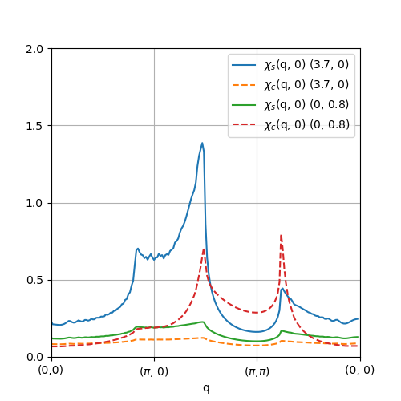

# Sample for the extended Hubbard model (h-wave ver.1.0)

## What's this sample?

The Hamiltonian for the extended Hubbard model on a two-dimensional square lattice is given by
```math
\mathcal{H} = -t\sum_{ \langle ij \rangle, \sigma}(c^\dagger_{i\sigma} c_{j\sigma} + \text{h.c.}) + U \sum_{i} n_{i\uparrow} n_{i\downarrow} + V \sum_{\langle ij \rangle} n_i n_j,
```
where $t=1$, $U$ and $V$ are transfer integrals, onsite and nearest-neighbor Coulomb interactions, respectively. 

In the following, we repoduce Fig. 1 in the following reference:

- A.Kobayashi, Y. Tanaka, M. Ogata, and Y. Suzumura, "Charge fluctuation induced superconducting state in two-dimensional quarter-filled electron systems"
  - [J.Phys.Soc.Jpn. 73, 1115(2004)](https://journals.jps.jp/doi/10.1143/JPSJ.73.1115).
  - [arXiv:cond-mat/0310576](https://arxiv.org/abs/cond-mat/0310576).

In this sample, the electron filling is set as 3/4 and the temperature is set as 0.01. Since this paper does not describe the size of the lattice and Matsubara frequencies, we set here to Nx=Ny=128 and Nmat=4096 respectively.

## Preparation

In this sample, we use the following python library in view.py:
- matplotlib

## How to run

0. First, create interaction files using ``hwave_dry.out`` included in ``StdFace`` in the ``onsite`` and ``coulomb`` directory.
The installation of ``hwave_dry.out`` is written in the manual of ``H-wave``.
This step can be skipped as the output results are placed in their own directories.

```
$ cd onsite
$ hwave_dry.out stan1.in
$ cd ../coulomb
$ hwave_dry.out stan2.in
$ cd ..
```

In ``stan1.in`` , we set ``t=1`` , ``U=3.7``, and ``V=0.0``.
In ``stan2.in`` , we set ``t=1`` , ``U=0.0``, and ``V=0.8``.


2. Create an input file for H-wave. In this sample, the input files are already prepared as ``input.toml`` in the ``onsite`` and ``coulomb`` directory.

For using  $chi_0(q)$ calculated in the ``onsite`` directory, 
The following settings have been added to the ``[file]`` section of ``input.toml`` in the ``coulomb`` directory.

```
[file.input]
  path_to_input = "../onsite/output"
  chi0q_init = "chi0q.npz"
```

3. Execute H-wave by typing the following commands:

```
$ cd onsite
$ hwave input.toml
$ cd ../coulomb
$ hwave input.toml
$ cd ..
```

It takes about 10 minutes for all calculations to be completed.
If your PC does not have enough memory, please set Nz=1024 in ``input.toml``.
After finishing the calculations, ``chiq.npz`` is outputted to the ``output`` directory.

4. See the calculation results.

To check the calculation results, ``view.py`` is prepared. ``view.py`` can be run with the following command:

```
$ python3 view.py
```

Then, you can see the following image.



Author: Kazuyoshi Yoshimi (2023/04/08)