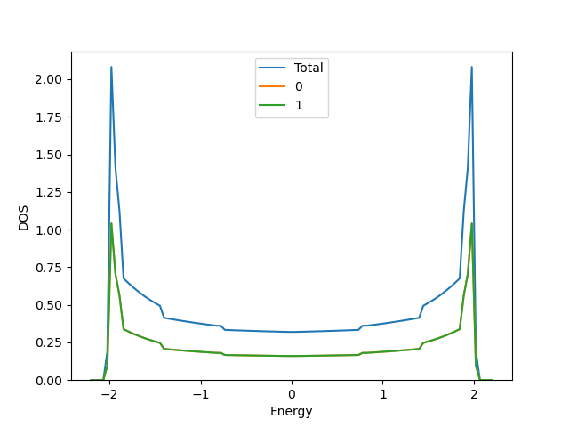

# Sample for plotting band

## What's this sample?

``calc_dos.py`` is a tool for calculating the Density of states (DOS) from the output of ``UHFk`` mode.
This is the sample for calculating the Density of states (DOS) of a tight-binding model on chain.


## Preparation

Make sure that both `hwave` package (this project) and `hwave_dry.out` of `StdFace` are installed.
We use [`libtetrabz`](https://pypi.org/project/libtetrabz/) to calculate DOS and `matplotlib` to plot the result.
If you have not installed it, please run the following command.

```bash
python3 -m pip install matplotlib
python3 -m pip install libtetrabz
```

## How to run

```bash
hwave_dry.out stan.in
hwave input.toml
python3 calc_dos.py --plot
```

After running the commands above, the result files `dos.dat` and `dos.png` are outputted.
`dos.dat` includes the info of the Density of states. 
The 1st raw is the energy, the 2nd raw is the total DOS, and the (3+n)-th raw is the DOS of the n-th orbital.

`dos.png` is the figure of the band dispersion plotted by `matplotlib`, which is shown as the following figure.



## Usage of ``calc_dos.py``

``calc_dos.py`` has the following options.

```
usage: calc_dos.py [-h] [--input INPUT] [--ene_window ENE_WINDOW]
                   [--ene_num ENE_NUM] [--plot]

optional arguments:
  -h, --help            show this help message and exit
  --input INPUT        input file of hwave
  --ene_window ENE_WINDOW
                        energy window; [ene_low, ene_high]. If None, ene_low =
                        ene_min - 0.2, ene_high = ene_max + 0.2
  --ene_num ENE_NUM     energy step
  --plot                plot DOS
```

In ``calc_dos.py``, the following variables are read from the input file of hwave.

- For obtaining the information of unit cell vector
  - ``file.input.interaction.path_to_input``
  - ``file.input.interaction.Geometry``

- For obtaining the information of the eigen energy
  - ``file.output.path_to_output``  
  - ``file.output.eigen`` 
  - ``mode.param.CellShape``


Kazuyoshi Yoshimi (2023/03/19)